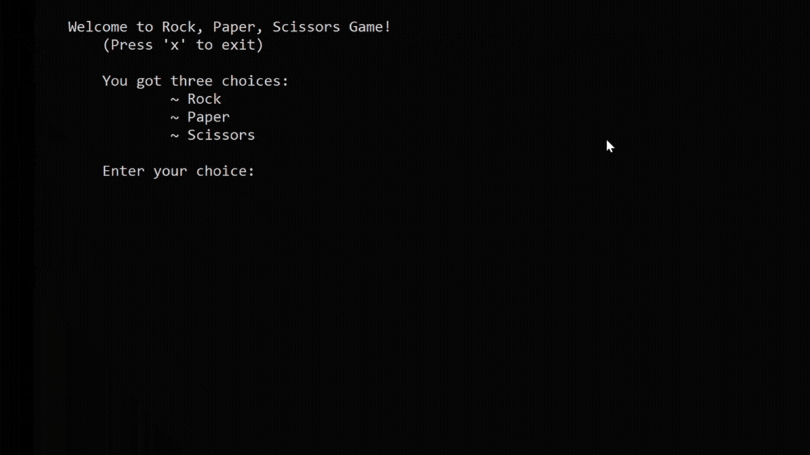

# Rock, Paper, Scissors Game

This is a simple implementation of the classic hand-game "Rock, Paper, Scissors" in C++. The game allows a user to play against the computer and keeps track of the user's score.

## Description

"Rock, Paper, Scissors" is usually played between two people, where each player simultaneously forms one of three shapes with an outstretched hand. The possible outcomes are:

- Rock (a fist)
- Paper (an open hand)
- Scissors (a fist with the index and middle fingers extended, forming a V)

The rules are simple:
- Rock crushes Scissors
- Scissors cuts Paper
- Paper covers Rock

## How to Play

1. When you run the program, you will be prompted to enter your choice: "rock", "paper", or "scissors".
2. The computer will randomly generate its choice.
3. The program will then determine the winner based on the rules of the game.
4. The user score will be displayed if the user wins.
5. You can play multiple rounds and choose to play again or exit the game.

## Code's Output

## How to Compile and Run

1. Save the code to a file on your local computer.
2. Open a terminal and navigate to the directory containing the file.
3. Compile and Run the code using a C++ compiler.

